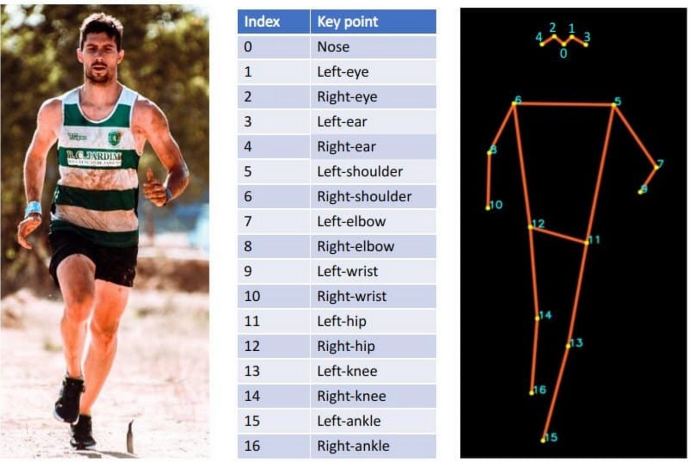
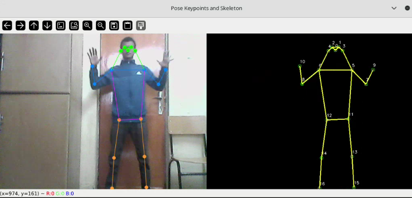

# Pose Detection with YOLOv8


This project implements a real-time pose detection system using the YOLOv8 model and OpenCV. It captures video from a webcam, detects human pose keypoints, and visualizes them on the video stream.


## Screenshots



## Features

- Real-time pose detection using YOLOv8.
- Visualization of keypoints and skeleton on the video feed.
- Configurable connections between keypoints for drawing skeletons.

## Requirements

Ensure you have the following installed:

- Python 3.x
- OpenCV
- NumPy
- CVZone
- Ultralytics YOLO

You can install the required Python packages using pip:

```bash
pip install -r requirements.txt
```

## Installation
### 1. Clone the Repository
```bash
git clone https://github.com/Nebyat19/Pose-Detection-with-YOLOv8.git
cd Pose-Detection-with-YOLOv8
```

## Usage

Run the script with the following command:
```bash
python3 src/skeleton.py
```

## Contributing

Feel free to submit issues or pull requests. Contributions are welcome!

